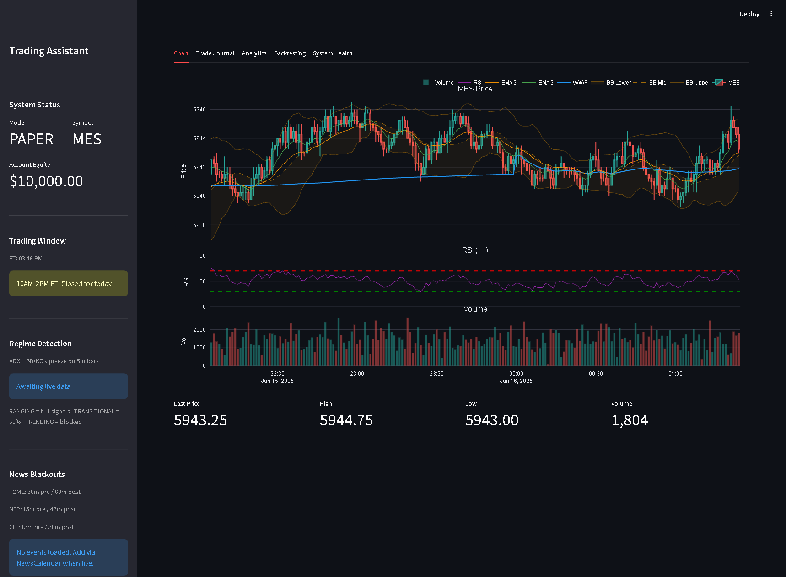
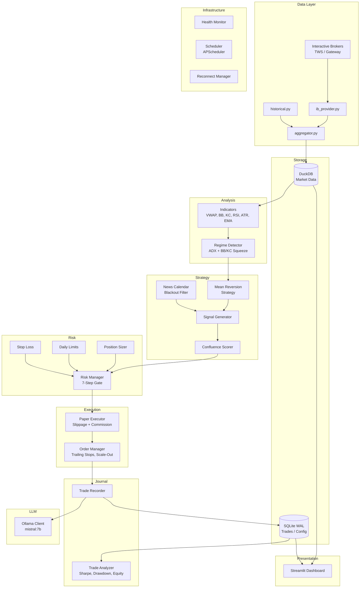
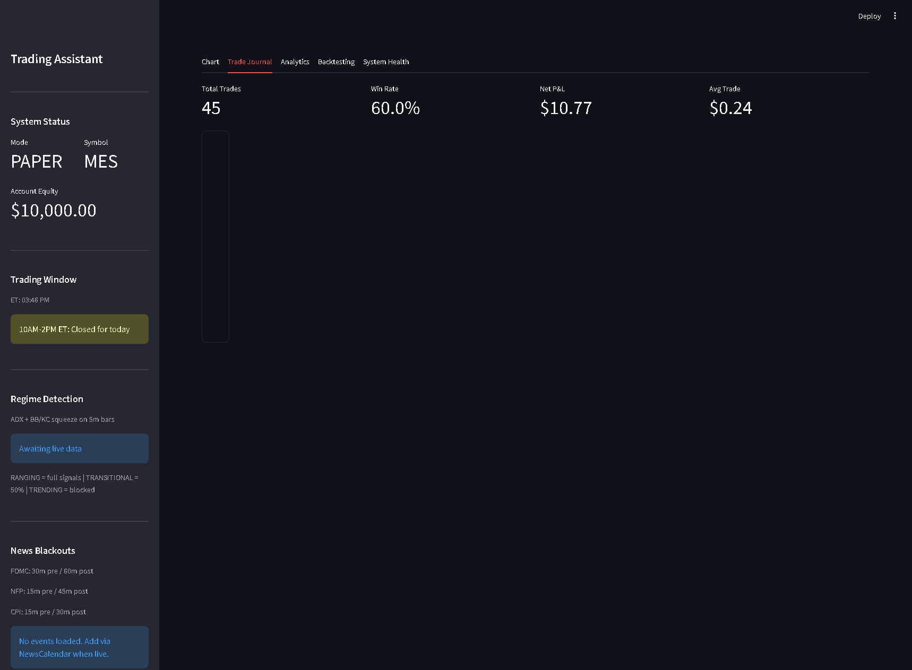
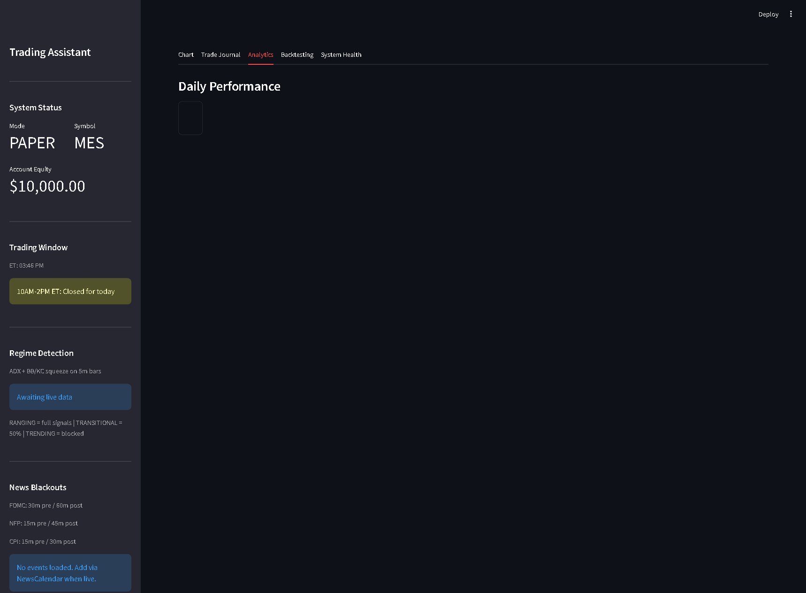
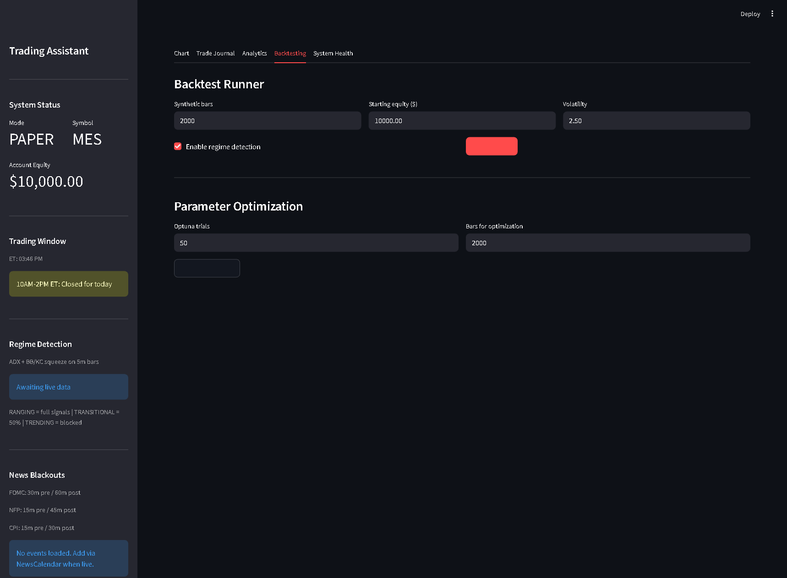
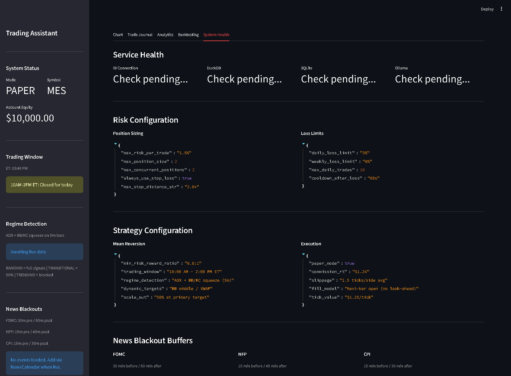
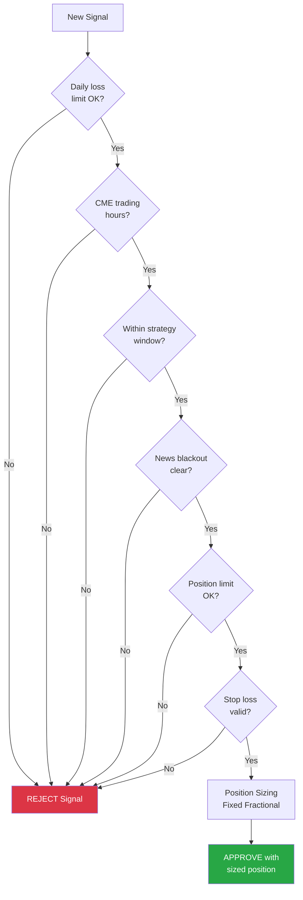
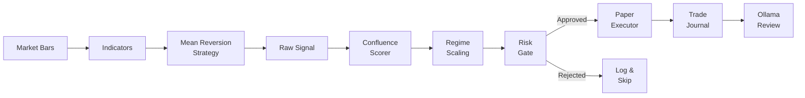

# Trading Assistant

An AI-powered day trading assistant for **MES (Micro E-mini S&P 500) futures**. Combines real-time market data from Interactive Brokers, technical analysis, risk management, and local LLM trade reviews — all through an interactive Streamlit dashboard.



---

## Features

**Real-Time Market Data**
- Live 5-second bars from Interactive Brokers via `ib_async`
- Automatic bar aggregation (5s &rarr; 1m &rarr; 5m OHLCV)
- DuckDB storage for fast analytical queries
- Auto-reconnect with exponential backoff

**Technical Indicators**
- Session-anchored VWAP
- Bollinger Bands (20-period, 2&sigma;)
- Keltner Channels (20-period, 1.5&times; ATR)
- RSI (14), ATR (14), EMA (9 / 21)

**Market Regime Detection**
- ADX-based classification: Ranging / Transitional / Trending
- BB/KC squeeze detection for consolidation
- Graduated signal scaling (1.0 / 0.5 / 0.0 by regime)
- Hysteresis to prevent whipsaw regime flipping

**Mean Reversion Strategy**
- BB touch + RSI confirmation + Keltner Channel filter
- Dynamic take-profit targets (BB middle / VWAP)
- Multi-factor confidence scoring
- Configurable 10AM–2PM ET trading window

**7-Step Risk Management**
1. Daily/weekly loss limits (3% daily, 6% weekly)
2. CME Globex trading hours enforcement
3. Strategy-specific trading window
4. News calendar blackout (FOMC, NFP, CPI buffers)
5. Concurrent position limit (max 2)
6. Stop-loss validation (ATR-based placement)
7. Fixed-fractional position sizing (1.5% max risk/trade)

**Backtesting & Optimization**
- Full pipeline replay with next-bar-open fills (no look-ahead bias)
- Optuna TPE parameter optimization over 8 strategy parameters
- Walk-forward analysis with rolling in-sample/out-of-sample windows

**LLM Trade Reviews**
- Local Ollama inference for per-trade coaching feedback
- Daily performance summaries
- Default model: `mistral:7b-instruct-v0.3-q4_K_M`

---

## Architecture



---

## Dashboard

### Chart View
Interactive candlestick chart with Bollinger Bands, VWAP, EMAs, RSI, and volume — plus real-time price metrics.


### Trade Journal
Track every trade with summary metrics: total trades, win rate, net P&L, and average trade size.



### Analytics
Daily performance breakdown with win rate, profit factor, Sharpe ratio, max drawdown, and risk events.



### Backtesting
Run backtests on synthetic data with configurable parameters. Optimize strategy parameters with Optuna.



### System Health
Monitor all service connections (IB, DuckDB, SQLite, Ollama), view risk/strategy configuration, and news blackout schedules.



---

## Project Structure

```
src/
├── config.py              # Pydantic settings (IB, trading, Ollama, DB)
├── main.py                # TradingApp orchestrator
├── core/
│   ├── models.py          # Domain models (Bar, Signal, Trade, Position)
│   ├── database.py        # SQLite ORM + DuckDB schema
│   └── logging.py         # Structured JSON logging (structlog)
├── market_data/
│   ├── ib_provider.py     # IB real-time connection via ib_async
│   ├── aggregator.py      # Bar aggregation (5s → 1m → 5m)
│   └── historical.py      # CSV loader + synthetic bar generator
├── indicators/
│   ├── calculator.py      # VWAP, BB, KC, RSI, ATR, EMA
│   └── regime.py          # ADX + BB/KC squeeze regime detection
├── strategies/
│   ├── base.py            # Abstract strategy with trading window
│   └── mean_reversion.py  # BB touch + RSI + Keltner filter
├── signals/
│   ├── generator.py       # Strategy → signal pipeline
│   ├── scorer.py          # Multi-factor confluence scoring
│   └── news_calendar.py   # FOMC/NFP/CPI blackout buffers
├── risk/
│   ├── manager.py         # 7-step risk gate
│   ├── position_sizer.py  # Fixed-fractional sizing
│   ├── daily_limits.py    # Daily/weekly P&L tracking
│   └── stop_loss.py       # ATR-based stops + trailing
├── execution/
│   ├── paper_executor.py  # Paper trading with slippage/commission
│   └── order_manager.py   # Position lifecycle, scale-out
├── journal/
│   ├── recorder.py        # Trade persistence to SQLite
│   └── analyzer.py        # Performance metrics (Sharpe, drawdown)
├── backtesting/
│   ├── engine.py          # Full pipeline replay (next-bar-open fills)
│   ├── results.py         # Backtest result models
│   ├── optimizer.py       # Optuna TPE optimization
│   └── walk_forward.py    # Rolling IS/OOS validation
├── llm/
│   └── client.py          # Async Ollama client for trade reviews
├── monitoring/
│   ├── health.py          # Service health checks
│   └── reconnect.py       # Exponential backoff reconnection
├── scheduler/
│   └── scheduler.py       # APScheduler (P&L resets, health checks)
└── dashboard/
    └── app.py             # Streamlit UI (5 tabs)
```

---

## Tech Stack

| Category | Technology |
|---|---|
| Language | Python 3.12+ |
| Broker API | `ib_async` (Interactive Brokers TWS/Gateway) |
| Analysis | pandas, numpy, pandas-ta |
| Market Data DB | DuckDB |
| Trade/Config DB | SQLite (WAL mode) via SQLAlchemy |
| LLM | Ollama (local), httpx |
| Dashboard | Streamlit, Plotly |
| Optimization | Optuna (TPE sampler) |
| Scheduling | APScheduler |
| Logging | structlog (JSON) |
| Testing | pytest, pytest-asyncio, hypothesis |
| Linting | ruff |
| Build | hatchling |

---

## Getting Started

### Prerequisites

- **Python 3.12+**
- **Interactive Brokers TWS or IB Gateway** running on port 7497 (paper) or 7496 (live)
- **Ollama** running locally with a model pulled:
  ```bash
  ollama pull mistral:7b-instruct-v0.3-q4_K_M
  ```

### Installation

```bash
# Clone the repo
git clone https://github.com/codyk2/OllamaFun.git
cd OllamaFun

# Create virtual environment
python -m venv .venv

# Activate (Windows)
.venv\Scripts\activate
# Activate (macOS/Linux)
source .venv/bin/activate

# Install with dev dependencies
pip install -e ".[dev,optimize]"

# Copy and configure environment
cp .env.example .env
# Edit .env with your IB Gateway host/port and other settings
```

### Configuration

Key settings in `.env`:

```env
# Interactive Brokers
IB_HOST=127.0.0.1
IB_PORT=7497          # 7497=paper, 7496=live
IB_CLIENT_ID=1

# Trading
TRADING_SYMBOL=MES
PAPER_MODE=true
ACCOUNT_EQUITY=10000.0

# Ollama
OLLAMA_HOST=http://localhost:11434
OLLAMA_MODEL=mistral:7b-instruct-v0.3-q4_K_M
```

### Running

```bash
# Start the full trading app (IB connection + dashboard)
python -m src.main

# Or run the dashboard standalone with demo data
python -m scripts.seed_demo
streamlit run src/dashboard/app.py

# Run backtests
python -m scripts.run_backtest

# Run parameter optimization
python -m scripts.run_optimization
```

### Testing

```bash
# Run all tests
pytest tests/ -v

# Run with coverage
pytest tests/ --cov=src --cov-report=term-missing

# Run specific module tests
pytest tests/test_risk/ -v
pytest tests/test_backtesting/ -v
```

---

## Risk Management Flow



---

## Signal Pipeline



---

## License

This project is for personal/educational use. Not financial advice. Trading futures involves substantial risk of loss.
